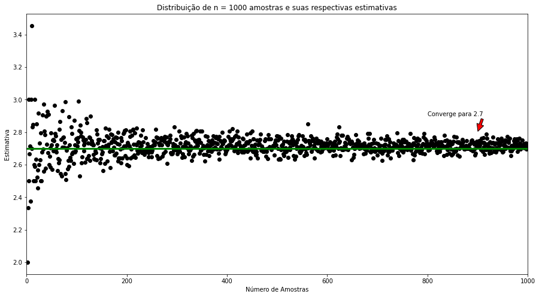
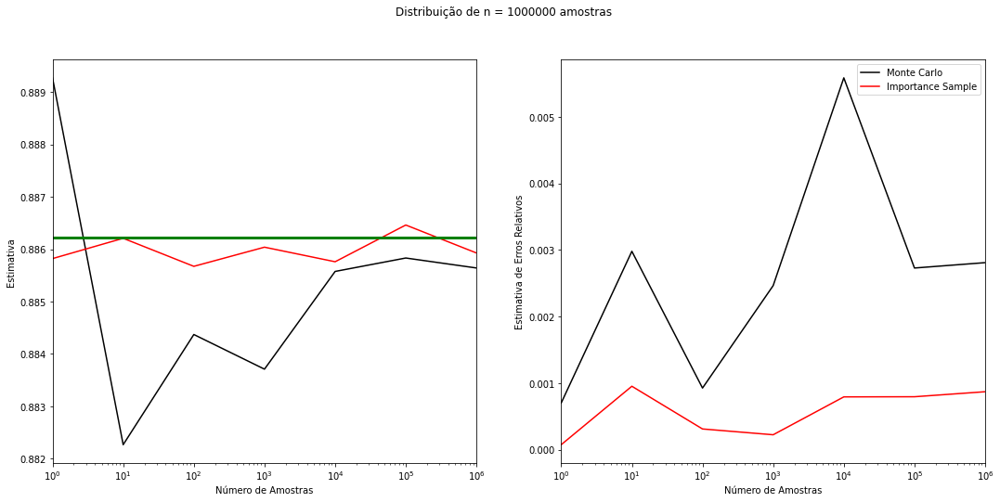
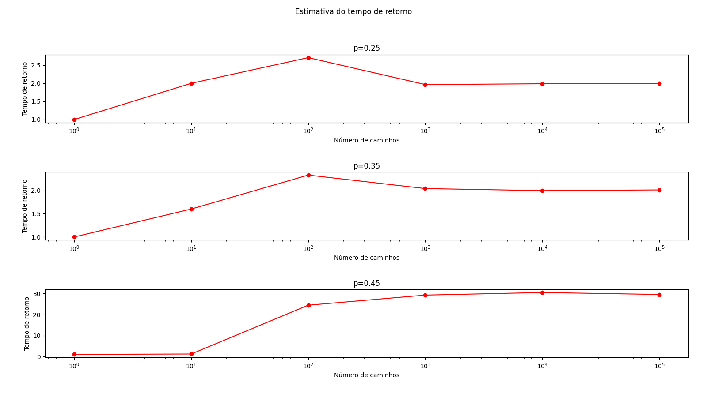

# Monte Carlo e Cadeias de Markov

####  Repositório para armazenar os códigos da disciplina de Monte Carlo e Cadeias de Markov.

É necessário [python3](https://docs.python.org/3/), [matplotlib](https://matplotlib.org/) e [numpy](http://www.numpy.org/) para funcionar.

-------

Animação da estimativa de Pi

  

-------

Estimativa da exponencial na base e

  

-------

Estimando integral de 0 a 10 de e^{-x^2}

  

-------

Estimativa do Tempo de Retorno

  

-------

Progresso do diâmetro no simulated annealing

 

