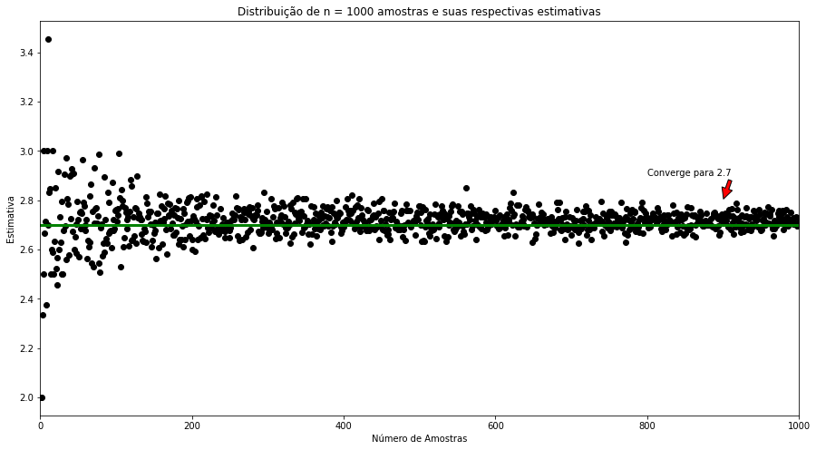
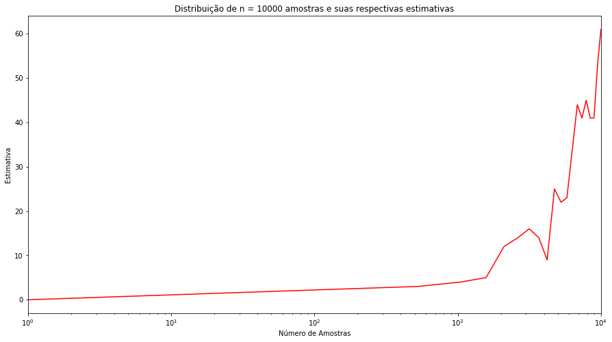
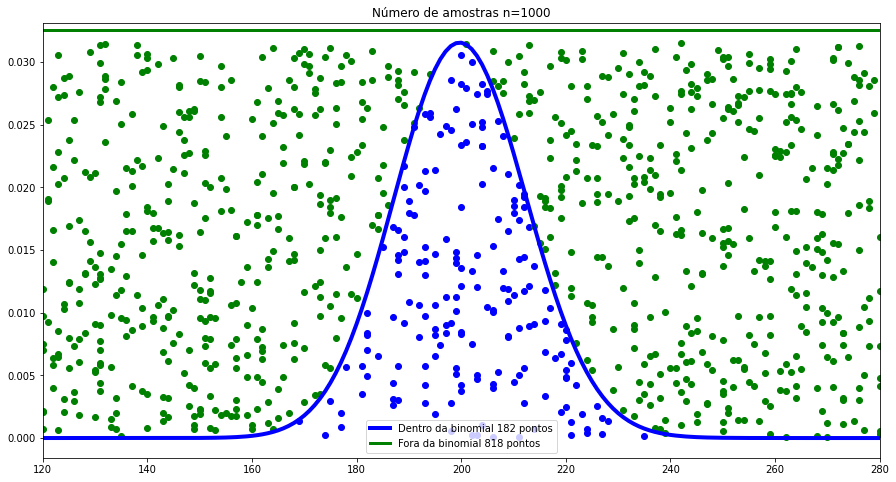
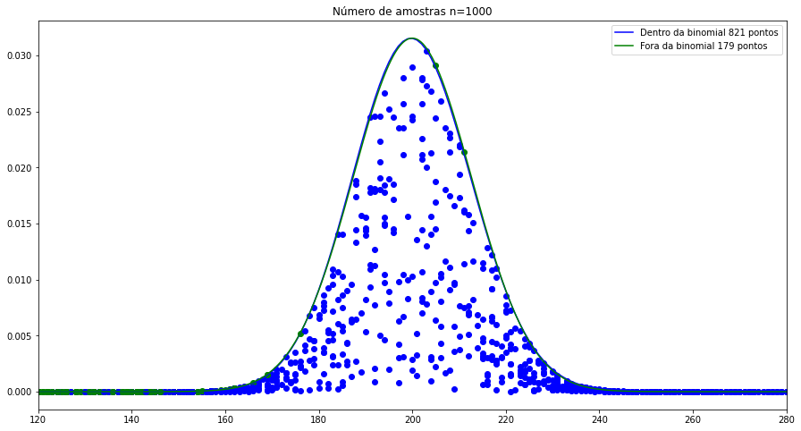
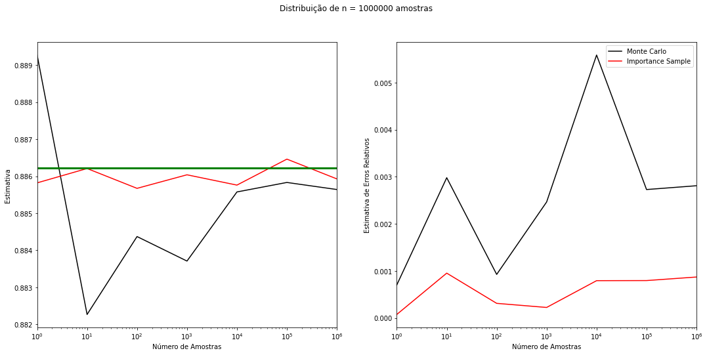

# Markov Chains and Monte Carlo Algorithms

Repository to storage the codes of the discipline Markov Chains and Monte Carlo Algorithms.

Animação da estimativa de pi

  

Estimando *e*

  

Quantos domínios possíveis existem na ufrj com tamanho 4 ou menos?

  

Aproximando X~Binomial(1000, 0.2)

  Aproximando com g(X) = 1

Aproximando com g~Normal(np, sqrt(np(1-p)))

  

Estimando integral de 0 a 10 de e^{-x^2}

  

